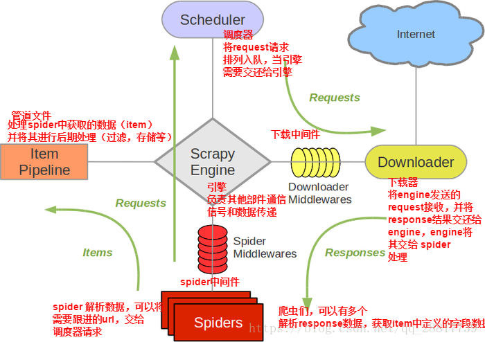

# Scrapy笔记
### Scrapy框架结构图

### Scrapy安装```pip install scrapy```
### 创建项目
1. 创建框架：
    ```
    scrapy startproject [项目名称]
    ```
2. 进入框架目录：
    ```
    cd [项目名称]
    ```
3. 生成蜘蛛程序：
    ```
    scrapy genspider [爬虫名称] [爬取域名]
    ```
4. 爬虫运行命令
    ```
    #   运行爬虫 输出保存到 文件名.csv 文件中
    scrapy crawl [爬虫名称] -o 文件名.csv[支持：csv\json\xml 三种文本文件]
    ```
5. 获取当前环境中安装的第三方库列表
    - 方式一：直接输出到控制台```pip list```或者```pip freeze```
    - 方式二：输出到文件 重定向输出（依赖项清单）```pip freeze > requirements.txt```
    - 安装依赖项清单：```pip install -r requirements.txt```
### items.py文件(用于数据组装)
```
class [爬虫名称]Item():
    # 定义若干个Field 作为key 用于获取爬虫生成器中的数据
    item对象_1 = scrapy.Field()
    item对象_2 = scrapy.Field()
    item对象_3 = scrapy.Field()
    ……
```
### spiders目录（蜘蛛程序所在目录文件）
爬虫名称.py文件结构：
1. 第一种构造方式：（在响应中获取新url实现翻页）
```
import scrapy
#   导入items对象 用于数据组装
from items import [爬虫名称]Item
#   爬虫类继承自Spider
class 爬虫名称Spider(scrapy.Spider):
    name = '爬虫名称'
    allowed_domains = ['限制爬取域名列表']
    start_urls = ['https://起始页面']

    #   解析器 response是返回对象
    def parse(self, response: HtmlResponse):
        #   实例化item对象
        list_item = [爬虫名称]Item()
        #   将返回的对象放入[选择器对象]用于解析
        sel = Selector(response)
        list_items = sel.css('css解析')
        #   循环获取响应数据列表
        for list in list_items:
            list_item["item对象_1"] = sel.css('使用css解析').extract_first()
            #   详细解析方式参见文档：('Select')['https://www.osgeo.cn/scrapy/topics/selectors.html']
            #   将解析到的界面数据装入生成器中
            yield list_item
        
        #   翻页获取数据 先获取翻页url 再使用Request再次请求
        hrefs_list = sel.css('css解析url地址列表')
        for href in href_list:
            #   使用urljoin 将原请求url与后续获取url拼接成一个新url
            url = response.urljoin(href.extract())
            #   使用生成器生成新的Request请求交给引擎做下一步请求（注意：调度器会自动过滤已爬取页面）
            yield Request(url=url)
```
2. 第二种构造方式：（无起始页，直接构造请求页面）
```
import scrapy
from scrapy import Request
#   导入items对象 用于数据组装
from items import [爬虫名称]Item
#   爬虫类继承自Spider
class 爬虫名称Spider(scrapy.Spider):
    name = '爬虫名称'
    allowed_domains = ['限制爬取域名列表']

    # 不使用起始页，使用start_requests直接构造所有请求页面
    def start_requests(self):
        for page in range(总页数):
            yield Request(url = "https://www.xxx.com?page={page}",meta={'proxy':'代理地址(实例：socks://127.0.0.1:端口)'})

    #   解析器 response是返回对象
    def parse(self, response: HtmlResponse):
        #   实例化item对象
        list_item = [爬虫名称]Item()
        #   将返回的对象放入[选择器对象]用于解析
        sel = Selector(response)
        list_items = sel.css('css解析')
        #   循环获取响应数据列表
        for list in list_items:
            list_item["item对象_1"] = sel.css('使用css解析').extract_first()
            #   详细解析方式参见文档：('Select')['https://www.osgeo.cn/scrapy/topics/selectors.html']
            #   将解析到的界面数据装入生成器中
            yield list_item
```
3. 层级结构请求数据爬取
```
class 爬虫名称Spider(scrapy.Spider):
    name = '爬虫名称'
    allowed_domains = ['限制爬取域名列表']

    # 不使用起始页，使用start_requests直接构造所有请求页面
    def start_requests(self):
        for page in range(总页数):
            yield Request(url = "https://www.xxx.com?page={page}",meta={'proxy':'代理地址(实例：socks://127.0.0.1:端口)'})

    #   解析器 response是返回对象
    def parse(self, response: HtmlResponse):
        #   实例化item对象
        list_item = [爬虫名称]Item()
        #   将返回的对象放入[选择器对象]用于解析
        sel = Selector(response)
        list_items = sel.css('css解析')
        #   循环获取响应数据列表
        for list in list_items:
            list_item["item对象_1"] = sel.css('使用css解析').extract_first()
            #   详细解析方式参见文档：('Select')['https://www.osgeo.cn/scrapy/topics/selectors.html']
            #   将解析到的界面数据装入生成器中
            yield Request(url=解析到的新请求url,callback=self.自定义解析函数,cb_kwargs={"item":已解析到的数据list_item})

    def 自定义解析函数(self,response,**kwargs):
        new_item = kwargs["item"]
        #  解析数据
        sel = Selector(response)
        list_items = sel.css('css解析')
        ……
        yield new_item;
```
### pipelines.py文件 管道文件 用于数据持久化（需先在settings.py文件中打开管道）
1. 写入数据库
```
class Pipeline_Excel:

    #   类初始化时创建 使用openpyxl将数据写入Excel文件
    def __init__(self):
        #   类初始化时创建工作簿  注意：要使用self绑定工作簿和工作表
        self.wb = openpyxl.Workbook()
        self.ws = self.wb.active
        self.ws.title = "工作表名"
        self.ws.append(("表头1","表头2","表头3",……))

    #   爬虫开始运行时Hook
    def open_spider(self,spider):
        ...

    #   爬虫关闭时调用Hook
    def close_spider(self,spider):
        self.wb.save(工作簿名称.xlsx)   # 保存工作簿

    #   管道数据处理(关键方法)
    def process_item(self, item, spider):
        #   具体的key查看items.py 中的封装 和 spider解析处理的yied的返回
        数据1 = item.get(key_1,没有数据返回内容)
        数据2 = item.get(key_2,没有数据返回内容)
        数据3 = item.get(key_3,没有数据返回内容)
        self.ws.append((数据1,数据2,数据3,……))
        ……
        return item # 最后还要将数据返回给其他管道使用
```
2.  写入数据库
```
class Pipeline_Mysql:

    #   类初始化时创建 数据库连接
    def __init__(self):
        #   建立连接
        self.conn = pymysql.connect(
            host=主机ip地址,
            port=端口,
            user=用户名,
            password=连接地址,
            database=数据库名,
            charset=字符集
        )
        # 获取数据库游标
        self.cursor = self.conn.cursor()

    #   爬虫开始运行时Hook
    def open_spider(self,spider):
        ...

    #   爬虫关闭时调用Hook
    def close_spider(self,spider):
        self.conn.commit()  #   提交数据
        self.conn.close()   #   释放游标

    #   管道数据处理(关键方法)
    def process_item(self, item, spider):
        #   具体的key查看items.py 中的封装 和 spider解析处理的yied的返回
        数据1 = item.get(key_1,没有数据返回内容)
        数据2 = item.get(key_2,没有数据返回内容)
        数据3 = item.get(key_3,没有数据返回内容)
        ……
        self.cursor.execute(
            'insert into 表名 (列名1,列名2,列名3,……) values (%s,%s,%s,……)'.(数据1,数据2,数据3,……)
        )   #   注意：这是一个事务 最有要使用commit提交才会持久化到数据库
        
        return item # 最后还要将数据返回给其他管道使用
```
3.  批量写入数据库 提高写入效率(同样适用于其他类型文件的写入)
```
class Pipeline_Mysql:

    #   类初始化时创建 数据库连接
    def __init__(self):
        #   建立连接
        self.conn = pymysql.connect(
            host=主机ip地址,
            port=端口,
            user=用户名,
            password=连接地址,
            database=数据库名,
            charset=字符集
        )
        # 获取数据库游标
        self.cursor = self.conn.cursor()
        self.data = []  #   定义一个容器用于临时存储数据

    #   爬虫开始运行时Hook
    def open_spider(self,spider):
        ...

    #   爬虫关闭时调用Hook
    def close_spider(self,spider):
        self._write_to_db()
        self.conn.close()   #   释放游标

    #   管道数据处理(关键方法)
    def process_item(self, item, spider):
        #   具体的key查看items.py 中的封装 和 spider解析处理的yied的返回
        数据1 = item.get(key_1,没有数据返回内容)
        数据2 = item.get(key_2,没有数据返回内容)
        数据3 = item.get(key_3,没有数据返回内容)
        ……
        self.data.append((数据1,数据2,数据3,……))
        if len(self.data) == 100:   # 满100条写入一次并提交
            self._write_to_db()
            self.data.clear()   #   清空data中的数据
        return item # 最后还要将数据返回给其他管道使用
    
    def _write_to_db(self):
            self.cursor.executemany(
                'insert into 表名 (列名1,列名2,列名3,……) values (%s,%s,%s,……)'.self.data
            )   #   注意：这是一个事务 最有要使用commit提交才会持久化到数据库
            self.conn.commit()  #   提交数据
```
### middlewares.py中间件：下载中间件和蜘蛛中间件两个类（需先在settings.py文件中打开中间件）
1. 在下载中间件中设置代理
```
#   下载中间件
class ChanxiaohongDownloaderMiddleware:
    #   请求处理方法 发送的所有请求将被从这里别拦截处理后再发出 Hook
    def process_request(self, request: Request, spider):
        #   从这里设置请求代理
        request.meta = {'proxy':''}
        return None
```
2. 在下载中间件中设置cookies
```
#   下载中间件
class ChanxiaohongDownloaderMiddleware:
    #   请求处理方法 发送的所有请求将被从这里别拦截处理后再发出 Hook
    def process_request(self, request: Request, spider):
        #   从这里设置请求代理
        request.cookies = {cookie字典}
        return None
```
3. 在下载中间件中使用seleniunm模拟登录
```
#   导包
from webdriver_manager.chrome import ChromeDriverManager
from selenium import webdriver
from selenium.webdriver.common.by import By
from selenium.webdriver.support.ui import WebDriverWait
from selenium.webdriver.support import expected_conditions as EC
from selenium.webdriver.chrome.service import Service
from selenium.webdriver.chrome.options import Options
from selenium.webdriver.common.keys import Keys

#   selenium创建chrome浏览器 并配置浏览器参数
def create_chrome_driver(*,headless=Fasle):
    option = Options()
    if headless:
        #   设置无头浏览器
        option.add_argument('--headless')
        option.add_argument('--disable-gpu')
    #   下载在线安装浏览器驱动
    service = Service(executable_path=ChromeDriverManager().install())
    option.add_experimental_option("excludeSwitches",["enable-automation"])
    option.add_experimental_option("useAutomationExtension",False)
    browser = webdriver.Chrome(options=option, service=service)
    #   执行chrome开发者协议中的脚本命令 当页面加载时找到chrome浏览器的navigator对象，并对象webdriver属性设置成undefined
    browser.excute_cdp_cmd('Page.addScriptToEvaluateOnNewDocument',{'source':'Object.defineProperty(navigator,"webdriver",{get: () => undefined})'})
    #   返回谷歌浏览器对象
    return browser

#   模拟登录 获取cookies
def login(browser,url):
    browser.get(url)
    WebDriverWait(browser, 30).until(EC.presence_of_element_located((By.[定位方式], "账号输入框位置")))[1].send_keys(data['username'])  # 输入账号
    WebDriverWait(browser, 30).until(EC.presence_of_element_located((By.[定位方式], "密码输入框位置")))[1].send_keys(data['username'])  # 输入账号
    WebDriverWait(browser, 30).until(EC.presence_of_element_located((By.[定位方式], "登录按钮位置"))).send_keys(Keys.ENTER)  # 点击登录
    WebDriverWait(browser, 30).until(EC.presence_of_element_located((By.[定位方式], "个人信息")))   #   定位到个人信息表示登录成功
    #   获取cookies 并写入json文件
    with open('cookies.json','w') as file:
        json.dump(browser.get_cookies(),file)

#   读取json文件并 加载到浏览器中
def add_cookies(browser,cookie_file):
    with open(cookie_file,'r') as file:
        cookies_list = json.load(file)
        for cookie_dict in cookies_list:
            if cookie_dict['secure']
                browser.add_cookie(cookie_dict)
#   spider类代码
class [爬虫名称]Spider(scrapy.Spider):
    name = '爬虫名称'
    allowed_domains = ['限制域名.com']

    def start_requests(self):
        keywords = ["关键词1","关键词2","关键词3",……]
        for keyword in keywords:
            for page in range(爬取页数):
                url = f'https://爬取地址.com?参数关键词={keyword}&页码参数={page * 每页数量}'
                yield scrapy.Request(url=url)   # 使用生成的种子url 发送请求

    #   这里获得的response如果是使用JS加载的 则借助selenium在下载中间中拦截响应 渲染完成后再返回（重点）
    def parse(self, response: HtmlResponse):
        #   实例化item对象
        list_item = [爬虫名称]Item()
        #   将返回的对象放入[选择器对象]用于解析
        sel = Selector(response)
        list_items = sel.css('css解析')
        #   循环获取响应数据列表
        for list in list_items:
            list_item["item对象_1"] = sel.css('使用css解析').extract_first()
            #   详细解析方式参见文档：('Select')['https://www.osgeo.cn/scrapy/topics/selectors.html']
            #   将解析到的界面数据装入生成器中
            yield Request(url=解析到的新请求url,callback=self.自定义解析函数,cb_kwargs={"item":已解析到的数据list_item})

    #   这里获得的response如果是使用JS加载的 则借助selenium在下载中间中拦截响应 渲染完成后再返回（重点）
    def 自定义解析函数(self,response,**kwargs):
        new_item = kwargs["item"]
        #  解析数据
        sel = Selector(response)
        list_items = sel.css('css解析')
        ……
        yield new_item;

#   下载中间件拦截处理请求
class ChanxiaohongDownloaderMiddleware:
    #   类初始化
    def __init__(self):
        self.browser = create_chrome_driver(headless = True)  
        login(self.browser,'https://登录页地址')
        add_cookies(self.browser,'cookies文件名')

    #   爬虫结束运行Hook
    def __del__(self,spider):
        self.browser.close()
        self.browser.quit()

    #   请求处理方法 发送的所有请求将被从这里别拦截处理后再返回
    def process_request(self, request: Request, spider):
        #   拦截请求 使用selenium发送请求
        self.browser.get(request.url)
        #   返回 selenium 获取动态加载的源码 使用page_source获取
        return HtmlRespense(url=request.url,body=self.browser.page_source,request=request,encoding='utf-8')
```
### settings.py设置
```
# 请求头浏览器信息设置
USER_AGENT = "Mozilla/5.0 (Windows NT 10.0; Win64; x64) AppleWebKit/537.36 (KHTML, like Gecko) Chrome/111.0.0.0 Safari/537.36 Edg/111.0.1661.41"
# 是否遵循网站 robots协议 robots.txt文件 True：遵循 False：不遵循
ROBOTSTXT_OBEY = Fasle
# 并发请求数设置 2的n次方
CONCURRENT_REQUESTS = 32
# 开启随机延迟
RANDOMIZE_DOWNLOAD_DELAY = True
# 下载延迟 秒
DOWNLOAD_DELAY = 3
# 管道文件配置 可配置多个 值越小优先级越高
ITEM_PIPELINES = {
   "chanxiaohong.pipelines.Pipeline_Excel": 300,
   "chanxiaohong.pipelines.Pipeline_Mysql": 300,
}
# 下载中间件配置 可配置多个 值越小优先级越高
DOWNLOADER_MIDDLEWARES = {
   "chanxiaohong.middlewares.ChanxiaohongDownloaderMiddleware": 543,
}
```
### 在settings.py文件中设置自定义配置参数
1.  配置数据库连接参数
DB_HOST = '数据库连接地址'
DB_PORT = '端口号'
DB_USER = '用户名'
DB_PASS = '密码'
DB_NAME = '数据库名'
2. 配置ip地址池
IP_POOL = ['地址1','地址2','地址3',……]
3. 配置请求头USER_AGENT
USER_AGENTS = ['地址1','地址2','地址3',……]
4. 配置读取方式:在其他文件中读取配置
crawler.settings['配置名称：例如：DB_HOST']
